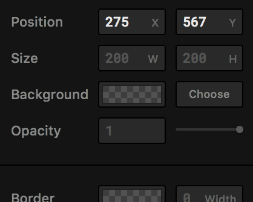

# 'Nerdeando'
## Framer Studio LVL Workshop | 25-26 July 2016

### Overview

In day one of this workshop, we're going to cover the basics of Framer studio. On day two, we'll convert a static Sketch mockup into an interactive prototype. We will publish our prototypes both to the web and to our phones.

> _Note: this workshop is written for Mac OS X users. Our prototype app will be an iOS prototype._

### Setup:

1. Install the free trial of [Sketch](https://www.sketchapp.com/static/download/sketch.zip) on your Mac
2. Install the free trial of [Framer Studio](http://framerjs.com/download/) on your Mac
3. Install the new [Framer Preview app](https://itunes.apple.com/app/id1124920547) on your iPhone

***
 
## Day 1: Framer Basics

### Getting Started

* Open Framer studio, and choose `File > New` From the top menu to create a new prototype. If you do not immediately see an iPhone 6s on the righthand side of the app, choose `Device > Apple iPhone 6s > iPhone 6s Silver`.
	* _The color of your iPhone frame doesn't really natter, but I choose silver for its contrast w/ the phone's black screen)_
* Choose `File > Save` and save the project as `day-one.framer` on your desktop.
	* _Worth noting: saving your project creates a folder called `day-one.framer`, rather than an individual file. This folder can be dragged onto the Framer Studio icon to open, or opened from Framer's `File > Open` menu.)_

Building with Framer is as easy as understanding its three main components:

1. Layers
2. States
3. Events

Today, we're going to walk through each of these to create a simple interaction.

### Layers

* To create a new layer, click the `Insert` button in the top left of Framer's UI and choose `Layer`
* You should now see 2 things:
	1. Code that reads `layerA = new Layer` has been written for you on the left
	2. A corresponding grey square has been created on the iPhone screen on the right
* Click and drag the layer to move it around the phone's screen. As you do, you'll notice smart guides appearing to help you align your layer on the screen, while code is being written for the layer's x & y position on the left. I've positioned my `layerA` square in the center of the phone's screen. My code reads:

```
layerA = new Layer
	x: 275
	y: 567
```

To the left of the `layerA = …` in your code, you'll notice a small square button with three lines:


If the handle is already highlighted (filled w/ a solid grey), great. If not, click the handle to highlight it. Now, turn your attention to Framer's center column. You should see the following:



These are the properties of the selected layer. You can change any of these values as you would in a visual design tool. As you do, Framer will write the corresponding code for you in the lefthand column.

Using this property inspector, change the border radius to `10`, the scale to `0.50` and change the background color to whatever you like (I've chosen a red color at `100%` opacity). Your code should look something like this:


On the iPhone's screen, your layer should now look like this:


This first set of properties you've now created for `layerA` is the layer's default **state**. Keep this idea in mind as we move on.

### States

States are variations of a layer that we can transition between. To add a state to `layerA`, choose `Insert > State > layerA`, like so:


You are immediately taken back into edit mode, where you can again change the properties of `layerA` to whatever your desired values for this new state, already given the name of `stateA` in your lefthand code editor. I've made the background white, the scale `2.00` and the rotation `45`.

My code for this new state looks like this:


And my layer now looks like this:


It's now time to add some interactivity to transition between this our default state and this new `stateA`.

### Events

To add a `Click` event to our layer, choose `Insert > Event > layerA > Click > Click`, like this:


You'll see that Framer has written the following code for you:

`layerA.onClick (event, layer) ->`

The cursor is already indented for you to write the code for your event. This is the only line of code we need to write to add both interactivity and our transition animation:

`layerA.states.next()`

The full code for your event should now read:

```
layerA.onClick (event, layer) ->
	layerA.states.next()
```

And you can now repeatedly click on your layer on the iPhone's screen to transition between the two states we've written.

What we just added, in programming terminology, is called a _click event._ How its above code reads, in human terms, is as follows:

1. `layerA.onClick …` when `layerA` is clicked, perform the actions listed on the below, indented lines (while we've only written one line below, we can, theoretically, add as many as we like to be performed when `layerA` is clicked)
2. `layerA.states.next()` Whatever the current state of `layerA`, transition to the next state. Per our example:
	* If our square is in its default state that we first created (the small, red square), transition to `stateA` (the larger, rotated white square)
	* However, if `layerA` is already in `stateA`, transition back to its default state

### Viewing The Prototype On Your iPhone

1. Keep Framer Studio open on your Mac
2. Make sure both your iPhone and Mac are on the same Wi-Fi network
3. Open the `Framer` app on your iPhone
4. You should see a thumbnail of your project w/ its file name listed beneath; click to open it
5. You will be prompted to enter an access code from Framer Studio. Click the `Mirror` button just above the center column in Framer Studio _**on your Mac**_ and enter the code shown into the Framer app on your phone:


You should now be able to interact w/ the prototype on your iPhone.

### Bonus: Extra State

Getting Back to Framer Studio on your Mac, let's insert another State to see what happens.

Just as before, use the `Insert` button to add another state:


You should now see `stateB` highlighted in your code editor, and you're already in edit mode in the center panel.

For our `stateB` values, I've chosen a blue background color, `8.00` for the scale (_I had to enter this via my keyboard — the slider doesn't allow such a large input value_) and a rotation of `180`:


Now, when you interact with your layer, you'll see it cycle through its 3 states — default, `stateA` and `stateB` — each time you click. To see this on your phone, Save your file (⌘ + S) in Framer Studio w/ your prototype open on your phone, and you should see a blue load bar on the top of the phone to indicate that your changes have been published and it is reloading)

### Fine tuning state control

Change the last line in our code from:

```
layerA.states.next()
```

To:

```
layerA.states.next('stateA', 'stateB')
```

Now, as you continuously click `layerA`, it cycles between its `stateA` and `stateB` states, never returning to its default, small red square state.

Finally, we'll add one more little block of code to govern the duration of our animation (_Note: this should be a code block unto itself, and **not** indented beneath our `layerA.onClick …` code_):

```
layerA.states.animationOptions =
    time: .5
```

As you can see, our transitions now move a bit more quickly. Animation duration in Framer is defined in seconds, so play around with this number to see how easily you can test different durations in search of the perfect transition. Be sure to save each time you change the value, so the prototype is updated on your phone

> _Worth noting: what little code we 'wrote' is was simply copied & pasted from Framer's Documentation. I encourage you to have a look at the docs on your own & add/remove code to the above example to see how it affects your demo._

***

## Day 2:

### Setup

Download project assets **NEED LINK for all assets, not just fonts**

***

### References:

* Quick Tour of Framer's New [Auto-Code](https://www.youtube.com/watch?v=XoV1iWH1naE)
* [Framer Documentation](http://framerjs.com/docs/) (Also available from within Framer studio via the `Docs` menu button)
* [Sketch App Sources](http://www.sketchappsources.com/): giant repository of free sketch UI assets & resources